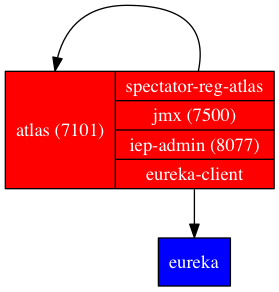

## Description

Example for running [Atlas](https://github.com/Netflix/atlas/) and:

* Having it register with [Eureka](https://github.com/Netflix/eureka/) using the
    [iep-module-eureka](https://github.com/Netflix/iep/tree/master/iep-module-eureka)
    library.
* Report metrics to itself using
    [iep-module-atlas](https://github.com/Netflix/iep/tree/master/iep-module-atlas).
* Configure for debugging using
    [iep-module-jmxport](https://github.com/Netflix/iep/tree/master/iep-module-jmxport) and
    [iep-module-admin](https://github.com/Netflix/iep/tree/master/iep-module-admin).
* Package the application for debian. These steps can be generalized for other
    systems.

The end result should look like:



## Usage

To run the example:

```
$ sbt iep-atlas/run
```

## Packaging

For Debian/Ubuntu:

```
$ sbt iep-atlas/debian:packageBin
```
